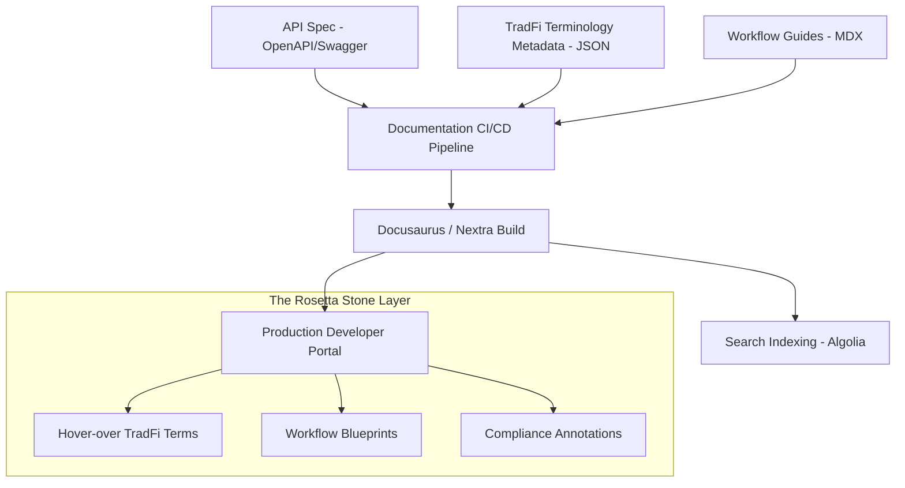

# Tech Spec: Archax "TradFi-to-Crypto" Documentation Architecture

## 1. System Overview
The Archax "Rosetta Stone" is not a static site. It is an "Annotation Layer" that sits on top of our existing developer documentation. It uses a metadata-driven approach to map technical API functions to institutional financial concepts.

## 2. Documentation Stack
- **Source:** Markdown files (MDX) hosted in a version-controlled repository.
- **SSG (Static Site Generator):** Docusaurus or Nextra (optimized for developer docs).
- **Search Engine:** Algolia DocSearch with custom "TradFi-to-Crypto" weighting.
- **Frontend Integration:** A custom "Translation Component" that provides hover-over definitions and mapping tags.

## 3. Data Flow & Integration (Mermaid)



## 4. Key Architectural Components

### 4.1 The Metadata Mapping Schema (`mappings.json`)
A central registry that defines the link between blockchain terms and TradFi terms.
```json
{
  "minting": {
    "tradfi_term": "Subscription / Issuance",
    "description": "Creation of new units of a digital asset against a deposited physical/traditional asset.",
    "context": "Primary Market"
  },
  "burning": {
    "tradfi_term": "Redemption",
    "description": "The process of returning tokens to the issuer for cancellation and reclaiming the underlying asset.",
    "context": "Secondary Market / Asset Liquidation"
  }
}
```

### 4.2 The "Translation" React Component
A custom MDX component that wraps technical terms.
```tsx
<Translate term="minting">The token minting process...</Translate>
// Renders as: The token [minting (Subscription/Issuance)] process...
```

### 4.3 Search Architecture
Custom Algolia "Synonyms" list that allows a user searching for "ISIN" to find the "Smart Contract Address" documentation.

## 5. Security & Maintenance
- **Version Control:** All documentation changes are subject to Peer Review and Compliance Review via PRs.
- **Regulatory Sync:** A quarterly audit by the Legal/Compliance team ensures that "TradFi-to-Crypto" mappings remain accurate under current law.
