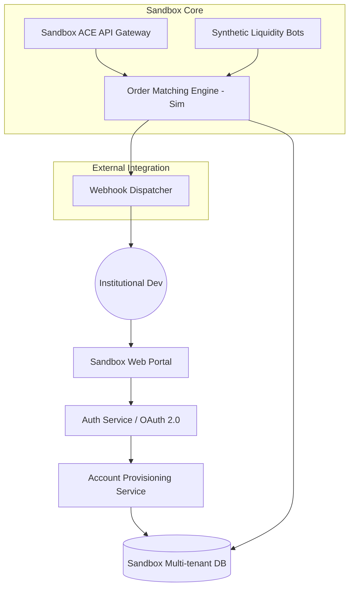

# Tech Spec: Archax "Zero-to-Trade" Sandbox Architecture

## 1. System Overview

The Archax Sandbox is a decoupled environment designed to mirror the Production ACE API v3.0 while providing instant, self-serve access. It consists of a dedicated web portal, an automated provisioning service, and a synthetic market engine.

### 2. High-Level Architecture (Mermaid)

## 3. Core Components

### 3.1. Sandbox Auth Service
- **Purpose:** Handles instant onboarding via third-party OAuth (GitHub, LinkedIn, Corporate SSO).
- **Implementation:** Built on OpenID Connect (OIDC). On first login, triggers the `Account Provisioning Service`.
- **Output:** Issues scoped JWTs for the Sandbox API.

### 3.2. Account Provisioning Service
- **Purpose:** Automatically creates a simulated trading account for new users.
- **Initial State:**
    - `Primary Account ID` (UUID)
    - `USD_SIM`: 10,000,000.00
    - `BTC_SIM`: 100.00
    - `ETH_SIM`: 1,000.00
- **Data Store:** Isolated PostgreSQL instance (Sandbox-only).

### 3.3. Synthetic Liquidity Engine (SLE)
- **Purpose:** Provides a dynamic, "living" order book for simulated assets.
- **Logic:** 
    - Multiple "Market Maker" bots run on a tight loop (100ms).
    - Bots follow a "Random Walk with Mean Reversion" model based on real-time external market mid-prices.
    - Ensures a spread of 1-5 bps for high-liquidity pairs (BTC/USD_SIM).

### 3.4. Sandbox ACE API Gateway
- **Purpose:** Mirrored implementation of the Production ACE API.
- **Compatibility:** Uses the exact same OpenAPI 3.0 schemas as Production.
- **Validation:** Strict request validation to catch integration errors early.

## 4. API Design (Key Endpoints)

### 4.1. Account Provisioning
`POST /v1/sandbox/setup`
- **Request:** `{ "provider": "github", "token": "..." }`
- **Response:** `{ "account_id": "...", "api_key": "...", "secret": "..." }`

### 4.2. Simulated Faucet (Refill)
`POST /v1/sandbox/faucet/refill`
- **Request:** `{ "asset": "USD_SIM", "amount": 1000000 }`
- **Constraint:** Rate-limited to once per 24h per account.

## 5. Data Flow: "The First Trade"

1.  **Request:** User sends `POST /v1/orders` (Limit Buy 1 BTC @ 60,000 USD_SIM).
2.  **Auth:** API Gateway validates JWT/API Key against Sandbox DB.
3.  **Balance Check:** Gateway confirms > 60,000 USD_SIM in user's sandbox account.
4.  **Matching:** Order is sent to the `Order Matching Engine - Sim`.
5.  **Execution:** The `Synthetic Liquidity Engine` has a "Sell" order at 59,999. Match occurs.
6.  **Settlement:** User's balance is updated (-60k USD_SIM, +1 BTC_SIM).
7.  **Notification:** Webhook Dispatcher sends a `trade_execution` event to the user's configured endpoint.

## 6. Security & Isolation

- **Zero-Prod Access:** The Sandbox environment has no network connectivity to the Production matching engine or custody wallets.
- **Data Masking:** Any shared schemas (e.g., ISINs) are prefixed with `SIM-` to prevent accidental production orders.
- **Ephemeral Data:** Sandbox accounts inactive for > 90 days are subject to automated cleanup.
