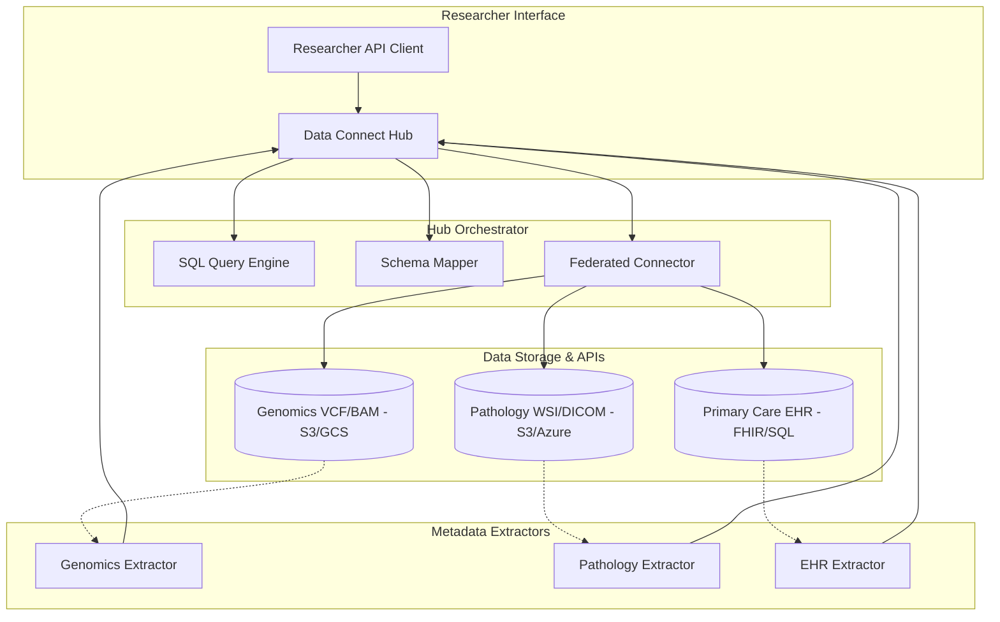

# Technical Architecture: GA4GH-Based API Hub

## 1. System Overview
The Multi-Omics "Data Connect" Hub is a middleware layer that virtualizes disparate data sources into a unified, queryable API.



## 2. API Design (GA4GH Data Connect)

### Endpoint: `GET /tables`
Lists available datasets as "Tables."
```json
{
  "tables": [
    { "name": "cohort_v1_genomics", "description": "WGS variant data" },
    { "name": "cohort_v1_pathology", "description": "WSI digital pathology scores" },
    { "name": "cohort_v1_primary_care", "description": "Longitudinal GP records" }
  ]
}
```

### Endpoint: `GET /table/{name}/info`
Returns the JSON Schema for a specific table.
```json
{
  "name": "cohort_v1_pathology",
  "data_model": {
    "type": "object",
    "properties": {
      "patient_id": { "type": "string" },
      "histology_score": { "type": "number" },
      "slide_url": { "type": "string", "format": "uri" }
    }
  }
}
```

### Endpoint: `POST /search`
Executes a SQL-like query across tables.
```json
{
  "query": "SELECT g.variant, p.histology_score FROM cohort_v1_genomics g JOIN cohort_v1_pathology p ON g.patient_id = p.patient_id WHERE g.gene = 'BRCA1'"
}
```

## 3. Component Breakdown
- **SQL Query Engine:** Translates standard SQL into optimized sub-queries for each data source (e.g., JSON filters for genomics metadata, SQL for EHR tables).
- **Federated Connector:** Manages secure connections and authentication tokens (OIDC) for diverse storage buckets and legacy databases.
- **Metadata Extractors:** Background workers that scan massive files (VCF, WSI) and extract "query-ready" metadata into high-speed indexing layers (Elasticsearch or DynamoDB).

## 4. Scalability & Performance
- **Caching:** Query results are cached at the Hub level to speed up repeated researcher requests.
- **Asynchronous Queries:** For massive datasets, the Hub supports "polling" for results using a job ID.
- **Edge Extraction:** Moving metadata extraction closer to the storage layer to minimize data transfer costs.
