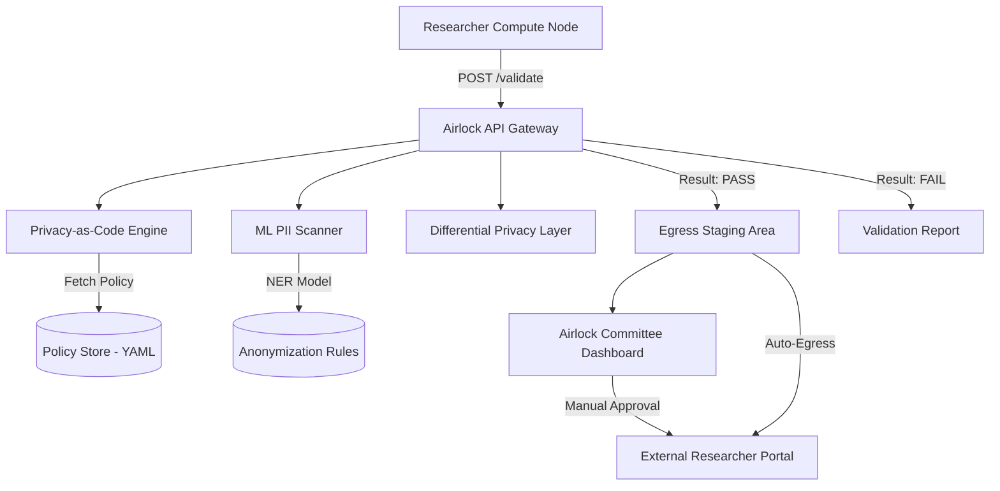

# Technical Architecture: Self-Serve Airlock API

## 1. System Overview
The Self-Serve Airlock API is a stateless microservice deployed within the Trusted Research Environment (TRE). It acts as a gateway between the compute clusters and the egress staging area.

## 2. Component Architecture



## 3. Data Flow
1. **Ingress:** API receives a `multipart/form-data` payload containing the file and metadata.
2. **Analysis:**
    - **Policy Engine:** Checks file extensions and basic metadata against the YAML policy.
    - **PII Scan:** Runs a multi-stage scanner (Regex -> Named Entity Recognition -> Genomic Coordinate Mapper).
    - **Privacy Filter:** If the file is a summary table, it checks cell counts and applies Laplacation noise if needed.
3. **Decision:** 
    - **Green:** Auto-egressed to the researcher's external endpoint.
    - **Amber:** High-risk but potentially safe; queued for human review with annotated "Areas of Concern."
    - **Red:** Rejected; report returned to researcher.

## 4. API Design

### `POST /v1/validate`
Validates a file without initiating egress.
- **Request:** `file` (Binary), `type` (Enum: `csv`, `pdf`, `weights`, `plot`), `project_id` (String).
- **Response:**
  ```json
  {
    "status": "FAIL",
    "violations": [
      { "type": "PII_DETECTED", "location": "Row 45, Col 2", "severity": "HIGH", "hint": "Looks like an NHS number." }
    ],
    "privacy_score": 0.45
  }
  ```

### `POST /v1/egress`
Submits a file for egress.
- **Request:** Same as validate + `destination_id`.
- **Response:**
  ```json
  {
    "submission_id": "egr-12345",
    "workflow_status": "PENDING_AUTOMATED_REVIEW"
  }
  ```

## 5. Technology Stack
- **Language:** Go (High performance for large file parsing).
- **Framework:** Gin (Lightweight API framework).
- **ML Scanner:** Python-based sidecar service using `Presidio` or `SpaCy` for NER.
- **Policy Storage:** HashiCorp Vault (Secure storage of privacy keys) + Git-ops for YAML policies.
- **Privacy Library:** OpenDP (Differential Privacy implementation).

## 6. Security Considerations
- **Internal Only:** The API is not accessible from the public internet; only from within the TRE.
- **Data Minimization:** No data from the files is stored permanently in the API logs; only metadata and validation results.
- **Isolation:** Each validation job runs in a temporary, isolated container to prevent cross-project leakage.
