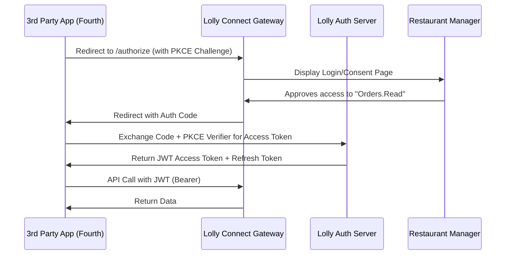

# Technical Architecture: Lolly Connect

## 1. System Overview
Lolly Connect is built on a modern, event-driven microservices architecture. It acts as an abstraction layer (API Gateway) over Lolly's legacy core systems, providing a unified, secure, and performant interface for external partners.

## 2. API Gateway & Management
We will utilize an enterprise-grade API Gateway (e.g., Kong or Azure API Management) to handle cross-cutting concerns:
- **Rate Limiting & Throttling:** Tiered limits (e.g., 100 req/min for Sandbox, 5000 req/min for Enterprise).
- **Authentication:** OAuth 2.0 / OpenID Connect (OIDC).
- **Caching:** Redis-backed caching for read-heavy endpoints (Catalog/Menus).
- **Transformation:** Converting legacy XML/SOAP internal responses to modern JSON.

## 3. Data Schema: "Lolly Unified Hospitality API"
A standardized JSON schema designed for interoperability:
```json
{
  "order_id": "LX-9901",
  "source": "Kiosk-01",
  "status": "PAID",
  "items": [
    {
      "id": "SKU-441",
      "name": "Vegan Burger",
      "price": 12.50,
      "tax_code": "VAT-20"
    }
  ],
  "totals": { "gross": 12.50, "net": 10.42, "tax": 2.08 }
}
```

## 4. OAuth 2.0 Sequence Diagram (Auth Code Flow + PKCE)


## 5. Security & Governance ("Bank-Grade")
Applying lessons from **SWIFT API Lifecycle** and **Metro Bank**:
1. **Scopes:** Fine-grained permissions (e.g., `inventory.read` vs `inventory.write`).
2. **MTLS:** Mandatory for High-Value Financial Syncs (Payroll/EOD).
3. **Audit Logs:** Every API call is logged with `correlation_id` for end-to-end traceability.
4. **Signature Validation:** All Webhooks are signed with a HMAC-SHA256 secret.

## 6. Event-Driven Sync (Webhooks)
Utilizing a Pub/Sub model (e.g., Azure Event Grid or AWS SNS/SQS) to push events to partners:
- **Payload:** Minimal (ID + Link) to encourage "Pull" behavior for large datasets.
- **Reliability:** 7-day message retention with dead-letter queues (DLQ).
