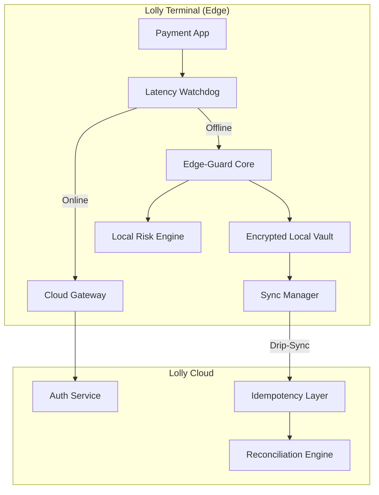

# Technical Architecture: Lolly Edge-Guard

## 1. System Overview
Lolly Edge-Guard is a decentralized payment authorization architecture. It treats each POS terminal as an autonomous agent capable of risk-mitigated decision-making during network isolation.

## 2. Component Architecture

### 2.1. Latency Watchdog (FR1)
- **Pulse:** Sends a lightweight heartbeat every 1000ms.
- **Trigger:** If latency > 2000ms or 3 consecutive heartbeats fail, switches state to `OFFLINE_RESILIENT`.
- **Hysteresis:** Requires 5 consecutive successful heartbeats before returning to `ONLINE` mode to prevent "flapping."

### 2.2. Local Risk Engine (FR2)
- **Rule Set:** Loaded into RAM at start of shift.
- **BIN Filter:** Cross-references card BIN against local `high_risk_bins.json`.
- **Velocity Check:** SQLite-based local store tracks `card_hash` frequency. 
    - *Default:* Max 3 transactions per hour per card in offline mode.
- **Floor Limits:** Dynamic limits based on card type (e.g., $50 for credit, $20 for debit).

### 2.3. Encrypted Local Vault (FR3)
- **Security:** AES-256 encryption using a per-terminal rotating key.
- **Persistence:** Transactions stored in a durable, tamper-evident log (WAL-mode SQLite).

### 2.4. Idempotency Layer & Sync (FR4)
- **Client-Side GUID:** Every transaction is assigned a `trace_id` at the moment of tap.
- **Drip-Sync:** When network returns, Sync Manager uploads transactions in batches of 5 every 30 seconds to avoid bandwidth spikes.
- **Server-Side Idempotency:** The Cloud Gateway uses Redis to track `trace_id` for 24 hours, ensuring zero double-charges during the transition from offline to online.

## 3. Data Flow: Offline Transaction
1. **Initiation:** Payment App requests $15.00.
2. **Watchdog:** Detects `OFFLINE` state.
3. **Risk Check:**
    - BIN is "Visa Debit" (Low Risk).
    - Velocity: First use of this card today.
    - Amount: $15.00 < $20.00 Floor Limit.
4. **Decision:** `LOCAL_APPROVE`.
5. **Storage:** Payload encrypted and written to Vault.
6. **UI:** "Approved" displayed; transaction complete in <2s.

## 4. Security Considerations
- **Key Rotation:** Encryption keys are rotated every 24 hours and stored in the terminal's Secure Element (TEE/SE).
- **PCI Compliance:** Sensitive card data is tokenized locally before storage; full PAN is never stored in the clear.
