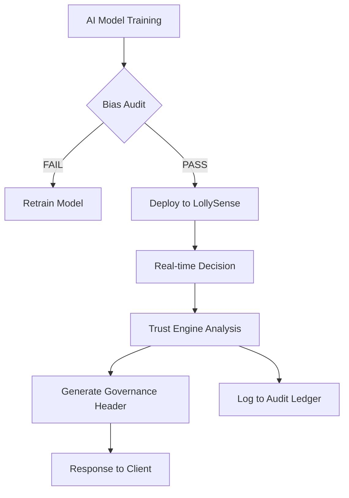

# Technical Architecture: Lolly Trust Infrastructure

## 1. System Overview
The Trust Infrastructure consists of two main components:
1. **The Trust Engine:** A microservice that consumes AI model logs and generates governance metadata based on ISO 42001 risk profiles.
2. **The Trust API Gateway:** An extension of our existing Apigee/Gateway layer that injects governance headers into responses.

## 2. High-Level Data Flow (ASCII)

```text
[ Client Application ] <--- (JSON + Trust Headers) --- [ Trust API Gateway ]
        |                                                     ^
        | (Request: Verify Age / Scan Tray)                   |
        v                                                     |
[ Core LollySense AI ] ---- (Decision + Raw Logs) ----> [ Trust Engine ]
                                                              |
                                                     (Fetch Risk Profile)
                                                              |
                                                     [ ISO 42001 DB ]
```

## 3. Governance Metadata Schema (Draft)

Every AI-driven response will include an `X-Lolly-Governance` header containing a base64-encoded JSON or a JWS (JSON Web Signature) for immutability.

```json
{
  "governance_id": "ISO-42001-2026-X99",
  "model_version": "lollysense-tray-v4.2",
  "decision_confidence": 0.985,
  "bias_check_status": "PASS",
  "data_retention_policy": "EXPIRED_AT_SESSION_END",
  "risk_tier": "LOW_IMPACT_OPERATIONAL",
  "audit_log_ref": "urn:lolly:audit:12345-abcde",
  "explanability": {
    "feature_weights": {"object_geometry": 0.7, "color_histogram": 0.3},
    "human_in_loop": false
  }
}
```

## 4. Trust Portal Component Architecture

- **Frontend:** React-based dashboard integrated into Lolly HQ (Client Admin).
- **Backend:** Node.js service for document management (S3 with KMS encryption).
- **Metrics Engine:** Aggregates anonymized AI performance data from ElasticSearch/Prometheus to generate bias visualization charts.

## 5. Security & Compliance (The "SWIFT" Standard)
- **Immutability:** Governance logs are written to an append-only ledger (e.g., AWS QLDB) to ensure audit integrity.
- **Identity:** Client access to the Trust Portal is managed via OpenID Connect (OIDC) with fine-grained RBAC (Role-Based Access Control) for Compliance Officers.
- **Data Privacy:** PII (Personally Identifiable Information) is never stored in the Trust Engine. Decisions are linked to session IDs, not user IDs.

## 6. Mermaid Diagram: AI Lifecycle Governance


